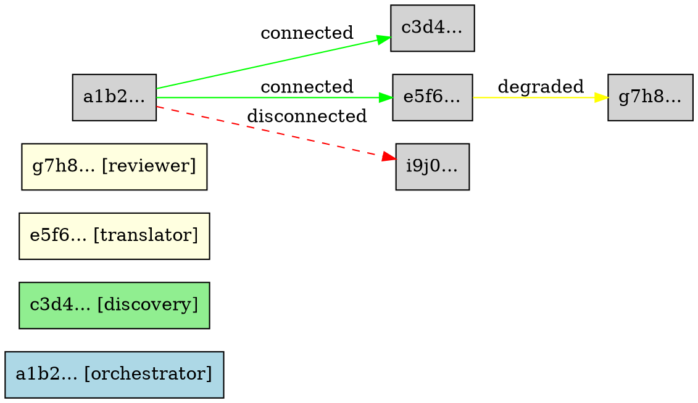

# AAFP Observability & Debugging

> **Status**: Research / Design Note
> **Scope**: Production observability for AAFP agent networks — metrics,
> logs, distributed traces, and the debugging toolchain needed to operate
> multi-hop agent topologies at scale.
> **Related code**:
> - `aafp-sdk/src/metrics.rs` — `AgentMetrics`, `MetricsSnapshot`, `HealthStatus`
> - `aafp-sdk/src/prometheus.rs` — `PrometheusExporter` (P2.6)
> - `aafp-sdk/src/simple.rs` — `RequestMetadata` with `trace_id` field (P2.7)
> - `aafp-sdk/src/routing/observability.rs` — `RoutingDecision`, `DecisionLog`, `RoutingMetrics` (T5)
> - `aafp-conformance/src/bin/generate_traces.rs` — golden wire-trace generation
> - `aafp-loadtest/src/metrics.rs` — `LatencyStats` (P50/P90/P99/P99.9)

---

## Table of Contents

1. [The Three Pillars of AAFP Observability](#1-the-three-pillars-of-aafp-observability)
2. [Distributed Tracing Across Agent Hops](#2-distributed-tracing-across-agent-hops)
3. [Trace Context in RequestMetadata](#3-trace-context-in-requestmetadata)
4. [Span Structure](#4-span-structure)
5. [Metrics Taxonomy](#5-metrics-taxonomy)
6. [Log Structure](#6-log-structure)
7. [Debugging Tools](#7-debugging-tools)
8. [Grafana Dashboard Improvements](#8-grafana-dashboard-improvements)
9. [Alerting Rules](#9-alerting-rules)
10. [SLO Definitions](#10-slo-definitions)
11. [OpenTelemetry Integration Code](#11-opentelemetry-integration-code)

---

## 1. The Three Pillars of AAFP Observability

AAFP is a **multi-hop, multi-agent** protocol. A single user request may
traverse 3–5 agents (orchestrator → discovery → specialist → relay →
aggregator), each running in a separate process, on a separate host, in a
separate trust domain. Traditional single-process debugging is insufficient.
The three classical pillars of observability — **metrics**, **logs**, and
**traces** — each play a distinct role:

| Pillar | Answers | Cardinality | Retention | AAFP mapping |
|--------|---------|-------------|-----------|--------------|
| **Metrics** | "Is it slow? Is it broken? How much?" | Low (aggregated) | Long (90 days) | `AgentMetrics` counters, Prometheus exporter, routing gauges |
| **Logs** | "Why did this specific thing fail?" | High (per-event) | Short (7–30 days) | Structured JSON with `agent_id`, `peer_id`, `capability`, `session_id` |
| **Traces** | "Where did time go across hops?" | Medium (sampled) | Medium (7 days) | OpenTelemetry spans propagated via `RequestMetadata.trace_id` |

### 1.1 Why all three are required

- **Metrics alone** tell you the handshake failure rate is 12%, but not *which*
  peers or *which* capability.
- **Logs alone** tell you a specific handshake failed with `INVALID_SIGNATURE`,
  but not whether this is a 0.01% edge case or a systemic CA compromise.
- **Traces alone** show you a 900 ms waterfall across 4 hops, but not that the
  root cause is DHT lookup latency spiking on one node.

Only the **correlation** of all three — a metric alert fires → you open a
Grafana panel → you jump to the exemplar trace → you read the structured log
lines on that trace span — gives you root cause in minutes instead of hours.

### 1.2 Current state in the Rust implementation

The existing `AgentMetrics` struct (`aafp-sdk/src/metrics.rs:18`) provides
**lock-free atomic counters** for 11 core signals:

```text
connections_active      connections_total       messages_sent
messages_received       bytes_sent              bytes_received
handshakes_completed    handshakes_failed       dht_records
relay_connections       messages_failed         uptime_seconds
```

These are exposed via `PrometheusExporter` (`aafp-sdk/src/prometheus.rs:35`)
on `GET /metrics` in Prometheus text format, with `agent_id` as the sole
label. `HealthStatus::from_metrics()` (`metrics.rs:260`) derives a three-level
health rollup (`Healthy` / `Degraded` / `Unhealthy`) from error rate,
handshake failure rate, and connection count.

The routing plane (`aafp-sdk/src/routing/observability.rs`) adds a
`DecisionLog` ring buffer (last 1024 routing decisions) and 10 routing
metrics (decision count, circuit-open count, hedge count, peer latency EWMA,
peer success rate, in-flight, circuit state).

**Gaps this document addresses:**

1. No distributed tracing — `RequestMetadata.trace_id` exists (P2.7) but is
   not yet wired to OpenTelemetry spans.
2. No histogram metrics — only counters and gauges. Latency distributions
   require histograms (P50/P90/P99).
3. No structured logging convention — `tracing` crate is used ad hoc across
   crates without a canonical JSON format or required fields.
4. No debugging CLI beyond `aafp health` and `aafp metrics` — no frame
   capture, replay, or topology visualization.

---

## 2. Distributed Tracing Across Agent Hops

### 2.1 The agent-hop problem

In AAFP, a request flows through a chain of agents. Consider a document
translation pipeline:

```
User → Orchestrator-Agent → Discovery-Agent → Translator-Agent → Reviewer-Agent → User
         (hop 0)              (hop 1)           (hop 2)            (hop 3)
```

Each hop is a separate QUIC connection with its own handshake, session, and
RPC exchange. Without distributed tracing, you see four independent
`aafp.rpc.duration` histograms and cannot reconstruct the end-to-end
waterfall. With distributed tracing, a single `trace_id` ties all four hops
together, and you can see that hop 1 (discovery) consumed 600 ms of the
850 ms total.

### 2.2 OpenTelemetry as the standard

AAFP adopts **OpenTelemetry (OTel)** as its tracing standard because:

- **Vendor-neutral**: exports to Jaeger, Tempo, Zipkin, Datadog, Honeycomb,
  or any OTLP-compatible backend.
- **W3C TraceContext**: standardized `traceparent` / `tracestate` headers
  that map cleanly to AAFP's `RequestMetadata.trace_id`.
- **Rust SDK maturity**: `opentelemetry` + `opentelemetry-otlp` crates have
  stable releases with Tokio integration.
- **Span attributes**: structured key-value attributes on spans map directly
  to AAFP protocol fields (`agent_id`, `capability`, `session_id`).

### 2.3 Trace context propagation

Trace context must survive the hop boundary. AAFP propagates context in
`RequestMetadata` (defined in `aafp-sdk/src/simple.rs:181`):

```rust
pub struct RequestMetadata {
    pub capability: String,
    pub session_id: Option<[u8; 32]>,
    pub trace_id: Option<String>,       // ← W3C traceparent (P2.7)
    pub deadline: Option<String>,
    pub content_type: Option<String>,
}
```

The `trace_id` field carries a W3C TraceContext `traceparent` string in the
canonical format:

```
traceparent: 00-<trace_id 32 hex>-<span_id 16 hex>-<flags 2 hex>
```

When an agent receives a request with `trace_id = Some(tp)`, it:

1. Extracts the `trace_id` and `span_id` from the traceparent.
2. Creates a new child span linked to the parent span context.
3. Generates a new `span_id` for its own work.
4. Propagates an updated traceparent (same `trace_id`, new `span_id`) to
   any downstream agent it calls.

If `trace_id` is `None` (the caller did not instrument), the receiving agent
**starts a new root trace**. This ensures every request is traceable even
when some agents in the network are not OTel-aware.

### 2.4 Baggage and tracestate

Beyond `traceparent`, AAFP may carry W3C `tracestate` (vendor-specific
sampling hints) and `baggage` (application-defined context) in the
`RequestMetadata.extra` map (a future extension). For now, `trace_id`
alone is sufficient for end-to-end correlation.

---

## 3. Trace Context in RequestMetadata

### 3.1 The trace_id field (P2.7)

The `trace_id` field was added in Phase 2.7 of the SDK redesign. It is an
`Option<String>` carrying the W3C traceparent. The `Default` implementation
sets it to `None`, meaning uninstrumented callers produce no trace context.

### 3.2 Injection and extraction

Every agent that acts as a **client** (initiating an RPC) must **inject** its
current span context into `RequestMetadata.trace_id` before sending. Every
agent that acts as a **server** (receiving an RPC) must **extract** the
traceparent and create a child span.

```rust
use opentelemetry::trace::Tracer;
use opentelemetry::global;
use opentelemetry_semantic_conventions as semconv;

/// Inject the current trace context into RequestMetadata.
pub fn inject_trace_context(meta: &mut RequestMetadata) {
    let tracer = global::tracer("aafp");
    let span = tracer.span_builder("rpc.client").start(&tracer);
    // Serialize span context as W3C traceparent
    let traceparent = format_traceparent(&span.span_context());
    meta.trace_id = Some(traceparent);
}

/// Extract trace context from RequestMetadata and start a child span.
pub fn extract_trace_context(meta: &RequestMetadata) -> opentelemetry::Context {
    if let Some(tp) = &meta.trace_id {
        if let Some(parent) = parse_traceparent(tp) {
            return opentelemetry::Context::current_with_span(
                RemoteSpanContext::new(parent).into()
            );
        }
    }
    // No parent — start a new root trace
    opentelemetry::Context::new()
}
```

### 3.3 Sampling

In a high-throughput agent network (thousands of RPCs/sec), tracing every
request is prohibitively expensive. AAFP uses **head-based sampling** at the
orchestrator (hop 0): the root agent decides with probability `p` (default
1%) whether to sample. If sampled, the `sampled` flag in the traceparent is
set to `01`, and all downstream agents inherit the sampling decision. This
ensures a trace is either complete (all hops) or absent (no orphan spans).

For debugging specific issues, **tail-based sampling** can be configured at
the OTel collector: keep 100% of traces with errors, 100% of traces with
P99 > 500 ms, and 1% of the rest.

---

## 4. Span Structure

AAFP defines a canonical span taxonomy. Every span has a `span.name`, a
`span.kind` (CLIENT or SERVER), and a set of semantic attributes.

### 4.1 Span hierarchy

```
trace (root, trace_id)
└── aafp.handshake (CLIENT)          ← orchestrator connects to translator
    ├── aafp.crypto.ml_dsa_verify    ← verify peer signature
    └── aafp.crypto.hkdf_derive      ← derive session keys
└── aafp.discovery.lookup (CLIENT)   ← orchestrator queries DHT
    ├── aafp.dht.find_node           ← Kademlia iterative lookup
    │   ├── aafp.dht.query (CLIENT)  ← query α=3 nodes in parallel
    │   └── aafp.dht.query (CLIENT)
    └── aafp.dht.get_record
└── aafp.rpc (CLIENT)                ← orchestrator calls translator.translate
    └── aafp.rpc (SERVER)            ← translator receives the call
        ├── aafp.capability.invoke   ← translator runs the model
        └── aafp.rpc (CLIENT)        ← translator calls reviewer.review
            └── aafp.rpc (SERVER)    ← reviewer receives the call
└── aafp.stream (CLIENT)             ← streaming response back
    └── aafp.stream (SERVER)
```

### 4.2 Canonical span definitions

#### 4.2.1 Handshake span

```rust
let mut span = tracer.span_builder("aafp.handshake")
    .with_kind(SpanKind::Client)
    .with_attributes([
        KeyValue::new("aafp.agent_id", local_agent_id_hex),
        KeyValue::new("aafp.peer_agent_id", peer_agent_id_hex),
        KeyValue::new("aafp.protocol_version", 1),
        KeyValue::new("aafp.key_algorithm", "ml-dsa-65"),
        KeyValue::new(semconv::attribute::NET_PEER_NAME, peer_addr),
    ])
    .start(&tracer);
```

| Attribute | Type | Description |
|-----------|------|-------------|
| `aafp.agent_id` | string | Local agent ID (hex) |
| `aafp.peer_agent_id` | string | Remote agent ID (hex) |
| `aafp.protocol_version` | int | Negotiated protocol version (1) |
| `aafp.key_algorithm` | string | Signature algorithm ("ml-dsa-65") |
| `aafp.handshake.outcome` | string | "success" / "failed" / "timeout" |
| `aafp.handshake.failure_code` | int | RFC-0005 error code if failed |
| `aafp.session_id` | string | Derived session ID (hex) |

#### 4.2.2 Discovery span

```rust
let span = tracer.span_builder("aafp.discovery.lookup")
    .with_kind(SpanKind::Client)
    .with_attributes([
        KeyValue::new("aafp.capability", capability_tag),
        KeyValue::new("aafp.dht.candidates_total", candidate_count),
        KeyValue::new("aafp.dht.strategy", strategy_name),
    ])
    .start(&tracer);
```

| Attribute | Type | Description |
|-----------|------|-------------|
| `aafp.capability` | string | Capability tag queried |
| `aafp.dht.candidates_total` | int | Candidates before filtering |
| `aafp.dht.candidates_passed` | int | Candidates after static filter |
| `aafp.dht.selected` | string | Selected agent ID (hex) |
| `aafp.dht.hedged` | bool | Whether hedging was used |
| `aafp.dht.lookup_ms` | int | DHT lookup duration |

#### 4.2.3 RPC span

```rust
let span = tracer.span_builder("aafp.rpc")
    .with_kind(SpanKind::Client)  // or SpanKind::Server on the receiving side
    .with_attributes([
        KeyValue::new("aafp.capability", capability),
        KeyValue::new("aafp.method", method_name),
        KeyValue::new("aafp.session_id", session_id_hex),
        KeyValue::new("aafp.peer_agent_id", peer_id_hex),
        KeyValue::new("aafp.stream_id", stream_id),
        KeyValue::new("rpc.system", "aafp"),
    ])
    .start(&tracer);
```

| Attribute | Type | Description |
|-----------|------|-------------|
| `aafp.capability` | string | Capability being invoked |
| `aafp.method` | string | RPC method (e.g. "aafp.capability.lookup") |
| `aafp.session_id` | string | Session ID from handshake |
| `aafp.peer_agent_id` | string | Remote agent ID |
| `aafp.stream_id` | int | QUIC stream ID |
| `aafp.rpc.status` | string | "ok" / "error" |
| `aafp.rpc.error_code` | int | RFC-0005 error code |
| `aafp.rpc.duration_ms` | int | RPC round-trip duration |

#### 4.2.4 Streaming span

For streaming responses (DATA frames with the MORE flag), a long-lived span
wraps the entire stream:

```rust
let span = tracer.span_builder("aafp.stream")
    .with_kind(SpanKind::Client)
    .with_attributes([
        KeyValue::new("aafp.stream_id", stream_id),
        KeyValue::new("aafp.stream.fragments", fragment_count),
        KeyValue::new("aafp.stream.bytes", total_bytes),
    ])
    .start(&tracer);
```

| Attribute | Type | Description |
|-----------|------|-------------|
| `aafp.stream_id` | int | QUIC stream ID |
| `aafp.stream.fragments` | int | Number of DATA frames |
| `aafp.stream.bytes` | int | Total bytes streamed |
| `aafp.stream.duration_ms` | int | Wall-clock stream duration |

---

## 5. Metrics Taxonomy

The existing `AgentMetrics` provides 11 counters. Production observability
requires a richer taxonomy organized by subsystem. All metrics use the
`aafp_` prefix and carry an `agent_id` label.

### 5.1 Connection metrics

| Metric | Type | Labels | Description |
|--------|------|--------|-------------|
| `aafp_connections_active` | gauge | agent_id | Current active connections (existing) |
| `aafp_connections_total` | counter | agent_id | Cumulative connections (existing) |
| `aafp_connection_duration_ms` | histogram | agent_id | Connection lifetime distribution |
| `aafp_handshakes_completed_total` | counter | agent_id | Successful handshakes (existing) |
| `aafp_handshakes_failed_total` | counter | agent_id, reason | Failed handshakes by reason |
| `aafp_handshake_duration_ms` | histogram | agent_id | Handshake latency distribution |

### 5.2 RPC metrics

| Metric | Type | Labels | Description |
|--------|------|--------|-------------|
| `aafp_rpc_requests_total` | counter | agent_id, capability, method | RPC requests received |
| `aafp_rpc_responses_total` | counter | agent_id, capability, method, status | RPC responses sent |
| `aafp_rpc_duration_ms` | histogram | agent_id, capability, method | RPC latency (P50/P90/P99/P99.9) |
| `aafp_rpc_payload_bytes` | histogram | agent_id, capability, direction | Request/response payload size |
| `aafp_rpc_errors_total` | counter | agent_id, capability, error_code | RPC errors by code |
| `aafp_rpc_in_flight` | gauge | agent_id, capability | Concurrent in-flight RPCs |

### 5.3 DHT metrics

| Metric | Type | Labels | Description |
|--------|------|--------|-------------|
| `aafp_dht_records` | gauge | agent_id | Records stored (existing) |
| `aafp_dht_lookups_total` | counter | agent_id, capability | DHT lookups initiated |
| `aafp_dht_lookup_duration_ms` | histogram | agent_id | Lookup latency |
| `aafp_dht_lookup_hops` | histogram | agent_id | Iterative lookup hop count |
| `aafp_dht_replication_total` | counter | agent_id | Record replications |
| `aafp_dht_bootstrap_status` | gauge | agent_id | 1=bootstrapped, 0=pending |

### 5.4 Pool metrics

| Metric | Type | Labels | Description |
|--------|------|--------|-------------|
| `aafp_pool_size` | gauge | agent_id, peer_agent_id | Connections per peer in pool |
| `aafp_pool_idle` | gauge | agent_id, peer_agent_id | Idle connections per peer |
| `aafp_pool_exhausted_total` | counter | agent_id | Pool exhaustion events |
| `aafp_pool_acquisition_ms` | histogram | agent_id | Time to acquire a connection |
| `aafp_pool_max` | gauge | agent_id | Max pool size configured |

### 5.5 Routing metrics

From `aafp-sdk/src/routing/observability.rs` (T5 scaffold):

| Metric | Type | Labels | Description |
|--------|------|--------|-------------|
| `aafp_routing_decisions_total` | counter | agent_id | Total routing decisions |
| `aafp_routing_circuit_open_total` | counter | agent_id, peer_agent_id | Circuit breaker opens |
| `aafp_routing_hedge_total` | counter | agent_id | Hedged requests |
| `aafp_routing_hedge_won_total` | counter | agent_id | Hedged requests that won |
| `aafp_routing_no_viable_total` | counter | agent_id | No viable candidate |
| `aafp_routing_decision_us` | histogram | agent_id | Decision latency |
| `aafp_peer_latency_ewma_ms` | gauge | agent_id, peer_agent_id | EWMA peer latency |
| `aafp_peer_success_rate` | gauge | agent_id, peer_agent_id | Peer success rate |
| `aafp_peer_in_flight` | gauge | agent_id, peer_agent_id | In-flight requests |
| `aafp_peer_circuit_state` | gauge | agent_id, peer_agent_id | 0=closed, 1=open, 2=half-open |

### 5.6 Histogram bucket strategy

AAFP uses custom histogram buckets optimized for protocol latencies:

```yaml
# Handshake / RPC latency (sub-millisecond to seconds)
buckets: [0.5, 1, 2.5, 5, 10, 25, 50, 100, 250, 500, 1000, 2500, 5000, 10000]

# DHT lookup hops (discrete)
buckets: [1, 2, 3, 4, 5, 7, 10, 15, 20]

# Payload bytes (powers of 2)
buckets: [64, 256, 1024, 4096, 16384, 65536, 262144, 1048576, 4194304]
```

---

## 6. Log Structure

### 6.1 Structured JSON logging

All AAFP logs are structured JSON emitted via the `tracing` crate with the
`tracing-subscriber` JSON formatter. Every log line is a self-contained JSON
object with canonical fields.

### 6.2 Canonical log schema

```json
{
  "timestamp": "2025-07-04T14:32:01.234Z",
  "level": "WARN",
  "target": "aafp_sdk::server",
  "span": {
    "name": "aafp.handshake",
    "trace_id": "0af7651916cd43dd8448eb211c80319c",
    "span_id": "b7ad6b7169203331"
  },
  "fields": {
    "message": "handshake failed",
    "agent_id": "a1b2c3d4e5f6...",
    "peer_id": "f6e5d4c3b2a1...",
    "capability": "inference",
    "session_id": "9e8f...",
    "error_code": 2001,
    "error": "ML-DSA-65 signature verification failed",
    "peer_addr": "203.0.113.42:4242",
    "duration_ms": 34
  }
}
```

### 6.3 Required fields

Every log line MUST include these fields when applicable (absent if not
relevant to the event):

| Field | Type | Description |
|-------|------|-------------|
| `agent_id` | string | Local agent ID (hex, first 16 chars) |
| `peer_id` | string | Remote agent ID (hex, first 16 chars) |
| `capability` | string | Capability involved in the event |
| `session_id` | string | Session ID (hex, first 16 chars) |
| `trace_id` | string | OpenTelemetry trace ID (32 hex) |
| `span_id` | string | OpenTelemetry span ID (16 hex) |
| `error_code` | int | RFC-0005 error code |
| `message` | string | Human-readable summary |

### 6.4 Log levels

| Level | Usage |
|-------|-------|
| `ERROR` | Fatal failures: handshake rejected, signature invalid, session terminated |
| `WARN` | Recoverable issues: retry triggered, circuit opened, pool exhausted, degraded health |
| `INFO` | Lifecycle events: agent started, connection established, capability registered |
| `DEBUG` | Protocol details: frame sent/received, DHT query, routing decision |
| `TRACE` | Verbose: raw frame bytes, crypto intermediate values (debug builds only) |

### 6.5 Sensitive data redaction

AAFP logs MUST NOT include:

- Private keys (ML-DSA-65 secret keys, session keys)
- Full signatures (log only first 8 bytes + length)
- Full nonces (log only first 4 bytes)
- User payload content (log only byte count and content type)
- TLS binding values

The `tracing` field formatter uses a custom `Redact` wrapper:

```rust
tracing::info!(
    agent_id = %redact(&local_id),
    peer_id = %redact(&peer_id),
    signature = %redact_bytes(&signature, 8),
    "handshake completed"
);
```

---

## 7. Debugging Tools

The `aafp` CLI (`aafp-cli/src/`) currently has `health`, `metrics`, `status`,
`peers`, `connect`, `discover`, `call`, `send`, `serve`, `relay`, `start`,
`init`, and `quickstart` subcommands. The following debugging subcommands are
proposed additions.

### 7.1 `aafp trace` — Frame capture for replay

**Purpose**: Capture every frame on a connection (or all connections) to a
file for offline analysis and replay.

```bash
# Capture all frames on a specific connection for 60 seconds
aafp trace --agent my-agent --peer peer-abc --duration 60s --output trace.aafp

# Capture all connections (full agent)
aafp trace --agent my-agent --duration 300s --output full-trace.aafp

# Filter by frame type
aafp trace --agent my-agent --types HANDSHAKE,RPC --output handshake-rpc.aafp
```

**Output format**: AAFP Trace File (`.aafp`), a CBOR-encoded sequence of
captured frame records:

```rust
#[derive(Serialize, Deserialize)]
pub struct CapturedFrame {
    pub timestamp_ns: u64,
    pub direction: FrameDirection,   // Sent / Received
    pub peer_agent_id: String,
    pub session_id: Option<[u8; 32]>,
    pub stream_id: u64,
    pub frame_type: u8,
    pub flags: u8,
    pub payload_len: usize,
    pub payload: Vec<u8>,            // redacted option: --redact
    pub trace_id: Option<String>,    // OTel trace context if present
}
```

This reuses the golden-trace infrastructure from
`aafp-conformance/src/bin/generate_traces.rs`, which already produces
`trace.bin`, `trace.hex`, and `meta.json` for canonical protocol vectors.

### 7.2 `aafp inspect` — Live frame inspector

**Purpose**: Real-time, Wireshark-like display of frames flowing through an
agent. Connects to the agent's debug endpoint and streams frames to the
terminal with color-coded frame types and decoded payloads.

```bash
# Live inspect all frames
aafp inspect --agent my-agent

# Filter by capability and peer
aafp inspect --agent my-agent --capability inference --peer peer-abc

# Show only RPC frames with decoded CBOR payloads
aafp inspect --agent my-agent --types RPC --decode
```

**Output** (TUI, refreshed every 100 ms):

```
┌─ AAFP Frame Inspector ──────────────────────────────────────────────┐
│ Agent: my-agent (a1b2...)  Peer: peer-abc (f6e5...)  Session: 9e8f │
├──────────────┬──────┬─────┬────────┬────────┬───────────────────────┤
│ Time         │ Dir  │ Typ │ Stream │ Flags  │ Payload               │
├──────────────┼──────┼─────┼────────┼────────┼───────────────────────┤
│ 14:32:01.234 │ ← RX │ HS  │ 0      │ 0x00   │ ClientHello (1952B)   │
│ 14:32:01.268 │ → TX │ HS  │ 0      │ 0x00   │ ServerHello (1952B)   │
│ 14:32:01.301 │ ← RX │ HS  │ 0      │ 0x00   │ ClientFinished (64B)  │
│ 14:32:01.302 │ → TX │ PONG│ 0      │ 0x00   │ (empty)               │
│ 14:32:01.350 │ ← RX │ RPC │ 5      │ 0x00   │ aafp.capability.lookup│
│ 14:32:01.352 │ → TX │ RPC │ 5      │ 0x00   │ response [inference]  │
│ 14:32:01.400 │ ← RX │ DATA│ 10     │ 0x01   │ 4096B (MORE)          │
│ 14:32:01.450 │ ← RX │ DATA│ 10     │ 0x00   │ 2048B (final)         │
└──────────────┴──────┴─────┴────────┴────────┴───────────────────────┘
```

### 7.3 `aafp replay` — Trace replay against a local agent

**Purpose**: Replay a captured `.aafp` trace file against a local agent to
reproduce bugs, test protocol changes, or validate conformance.

```bash
# Replay a captured trace against a local agent
aafp replay --trace trace.aafp --target 127.0.0.1:4242 --speed 1x

# Replay at 10x speed for stress testing
aafp replay --trace trace.aafp --target 127.0.0.1:4242 --speed 10x

# Replay with modified payloads (fuzzing)
aafp replay --trace trace.aafp --target 127.0.0.1:4242 --mutate
```

This leverages the existing conformance test infrastructure
(`aafp-conformance`) which already validates protocol compliance against
golden traces. The replay tool generalizes this to arbitrary captured traces.

### 7.4 `aafp topology` — Network graph visualization

**Purpose**: Discover and visualize the agent network graph — which agents
know about which, what capabilities they offer, and the connection state.

```bash
# Discover topology from a seed agent
aafp topology --seed my-agent --depth 3 --output topology.json

# Render as Graphviz DOT
aafp topology --seed my-agent --depth 3 --format dot | dot -Tpng > topology.png

# Live topology with health overlay
aafp topology --seed my-agent --depth 3 --live --refresh 5s
```

**Output** (DOT format):



### 7.5 `aafp health` — Deep health check

The existing `aafp health` command calls the `aafp.metrics` RPC and prints
the `HealthStatus`. The **deep** health check extends this to probe each
subsystem independently:

```bash
# Quick health (existing)
aafp health --agent my-agent

# Deep health check — probes all subsystems
aafp health --agent my-agent --deep
```

**Deep health output**:

```
AAFP Deep Health Check — agent my-agent (a1b2...)
─────────────────────────────────────────────────
Overall: DEGRADED

  Handshake:    ✓ HEALTHY    (success rate 98.2%, P99 42ms)
  DHT:          ✓ HEALTHY    (bootstrapped, 847 records, lookup P99 120ms)
  Pool:         ⚠ DEGRADED   (2/5 peers exhausted, acquisition P99 850ms)
  Capabilities: ✓ HEALTHY    (3 registered: inference, translation, review)
  Connections:  ✓ HEALTHY    (12 active, 0 relay)
  Routing:      ⚠ DEGRADED   (1 circuit open, 2 hedge wins in last 5m)

  Error rate:   2.1%  (threshold: 10%)
  Uptime:       14h 32m
  Last incident: 2h ago (pool exhaustion, recovered)
```

The deep health check issues targeted RPCs:
- `aafp.metrics` — overall counters (existing)
- `aafp.capability.list` — registered capabilities
- `aafp.dht.status` — DHT bootstrap state and record count
- `aafp.pool.status` — connection pool state per peer
- `aafp.routing.status` — circuit breaker states and peer health

---

## 8. Grafana Dashboard Improvements

### 8.1 Per-agent dashboards

The current Prometheus exporter uses `agent_id` as a label, enabling
per-agent dashboards via Grafana variables.

**Dashboard: AAFP Agent Overview** (per-agent, selected via dropdown):

1. **Stat panel**: Overall health status (Healthy/Degraded/Unhealthy)
2. **Time series**: Active connections + total connections (rate)
3. **Time series**: Messages sent/received rate (msg/s)
4. **Time series**: Throughput (bytes/s sent + received)
5. **Bar gauge**: Handshake success rate (%)
6. **Histogram heatmap**: RPC latency P50/P90/P99/P99.9
7. **Time series**: Error rate (%) with 10% threshold line
8. **Stat panel**: Uptime, DHT records, relay connections

**Grafana variable**:
```json
{
  "name": "agent",
  "type": "query",
  "datasource": "Prometheus",
  "query": "label_values(aafp_connections_active, agent_id)"
}
```

### 8.2 Network topology view

A Grafana **node graph panel** visualizes the agent network using the
topology data. Each node is an agent; edges are connections colored by
health (green=healthy, yellow=degraded, red=unhealthy).

**Data source**: A custom exporter that scrapes `aafp topology --format json`
from each agent and exposes it as node-graph-compatible metrics.

```promql
# Node graph: nodes
aafp_agent_info{agent_id="$agent"}

# Node graph: edges
aafp_connection_active{agent_id="$agent", peer_agent_id="$peer"}
```

### 8.3 Multi-agent fleet dashboard

For operators managing 50+ agents, a **fleet dashboard** provides an
at-a-glance matrix:

1. **Table**: All agents with columns: ID, health, connections, error rate,
   P99 RPC latency, DHT records, uptime. Color-coded cells (green/yellow/red).
2. **Heatmap**: Error rate by agent (rows) over time (columns).
3. **Time series**: Aggregate fleet throughput (sum across all agents).
4. **Alert panel**: Active alerts grouped by agent.

### 8.4 Distributed trace view

Using Grafana Tempo integration, the dashboard includes a **trace panel**
that links from any time-series point to the exemplar trace:

```
Click on a P99 latency spike → opens the specific trace in Tempo
→ waterfall view shows all agent hops with span durations
→ click a span → see structured logs for that span in Loki
```

This requires configuring Prometheus exemplars (linking trace IDs to
histogram buckets) and Tempo/Loki datasource links in Grafana.

---

## 9. Alerting Rules

### 9.1 Alert definitions (Prometheus Alertmanager)

```yaml
groups:
  - name: aafp_handshake
    rules:
      - alert: AafpHighHandshakeFailureRate
        expr: |
          sum(rate(aafp_handshakes_failed_total[5m])) by (agent_id)
          /
          (sum(rate(aafp_handshakes_completed_total[5m])) by (agent_id)
           + sum(rate(aafp_handshakes_failed_total[5m])) by (agent_id))
          > 0.05
        for: 5m
        labels:
          severity: warning
        annotations:
          summary: "High handshake failure rate for agent {{ $labels.agent_id }}"
          description: "Handshake failure rate is {{ $value | humanizePercentage }} (threshold 5%)"

      - alert: AafpHandshakeLatencyHigh
        expr: |
          histogram_quantile(0.99,
            rate(aafp_handshake_duration_ms_bucket[5m]))
          > 500
        for: 10m
        labels:
          severity: warning
        annotations:
          summary: "P99 handshake latency > 500ms for agent {{ $labels.agent_id }}"

  - name: aafp_rpc
    rules:
      - alert: AafpRpcLatencyHigh
        expr: |
          histogram_quantile(0.99,
            rate(aafp_rpc_duration_ms_bucket[5m]))
          > 50
        for: 10m
        labels:
          severity: warning
        annotations:
          summary: "P99 RPC latency > 50ms for agent {{ $labels.agent_id }}"

      - alert: AafpRpcErrorRateHigh
        expr: |
          sum(rate(aafp_rpc_errors_total[5m])) by (agent_id)
          /
          sum(rate(aafp_rpc_requests_total[5m])) by (agent_id)
          > 0.05
        for: 5m
        labels:
          severity: critical
        annotations:
          summary: "RPC error rate > 5% for agent {{ $labels.agent_id }}"

  - name: aafp_dht
    rules:
      - alert: AafpDhtUnreachable
        expr: aafp_dht_bootstrap_status == 0
        for: 5m
        labels:
          severity: critical
        annotations:
          summary: "DHT not bootstrapped for agent {{ $labels.agent_id }}"

      - alert: AafpDhtLookupSlow
        expr: |
          histogram_quantile(0.99,
            rate(aafp_dht_lookup_duration_ms_bucket[5m]))
          > 200
        for: 10m
        labels:
          severity: warning
        annotations:
          summary: "P99 DHT lookup > 200ms for agent {{ $labels.agent_id }}"

  - name: aafp_pool
    rules:
      - alert: AafpPoolExhaustion
        expr: increase(aafp_pool_exhausted_total[5m]) > 0
        for: 1m
        labels:
          severity: warning
        annotations:
          summary: "Connection pool exhausted for agent {{ $labels.agent_id }}"

      - alert: AafpPoolAcquisitionSlow
        expr: |
          histogram_quantile(0.99,
            rate(aafp_pool_acquisition_ms_bucket[5m]))
          > 100
        for: 5m
        labels:
          severity: warning
        annotations:
          summary: "P99 pool acquisition > 100ms for agent {{ $labels.agent_id }}"

  - name: aafp_routing
    rules:
      - alert: AafpCircuitOpen
        expr: aafp_peer_circuit_state == 1
        for: 2m
        labels:
          severity: warning
        annotations:
          summary: "Circuit breaker open: {{ $labels.agent_id }} → {{ $labels.peer_agent_id }}"

      - alert: AafpNoViableCandidate
        expr: increase(aafp_routing_no_viable_total[5m]) > 3
        for: 5m
        labels:
          severity: critical
        annotations:
          summary: "No viable routing candidate for agent {{ $labels.agent_id }}"

  - name: aafp_general
    rules:
      - alert: AafpAgentUnhealthy
        expr: aafp_connections_active == 0 and on() (time() - aafp_uptime_seconds) > 60
        for: 2m
        labels:
          severity: critical
        annotations:
          summary: "Agent {{ $labels.agent_id }} has no active connections"

      - alert: AafpHighMessageErrorRate
        expr: |
          sum(rate(aafp_messages_failed_total[5m])) by (agent_id)
          /
          (sum(rate(aafp_messages_sent_total[5m])) by (agent_id)
           + sum(rate(aafp_messages_received_total[5m])) by (agent_id))
          > 0.10
        for: 5m
        labels:
          severity: warning
        annotations:
          summary: "Message error rate > 10% for agent {{ $labels.agent_id }}"
```

### 9.2 Alert severity and routing

| Severity | Notification channel | Response time |
|----------|---------------------|---------------|
| `critical` | PagerDuty + Slack #aafp-alerts | 5 minutes |
| `warning` | Slack #aafp-alerts | 30 minutes |
| `info` | Slack #aafp-alerts (threaded) | Next business day |

---

## 10. SLO Definitions

### 10.1 Service Level Objectives

| SLO | Target | Measurement window | Error budget |
|-----|--------|--------------------|--------------|
| Handshake success rate | 99.9% | 30 days | 0.1% = ~43 min downtime/month |
| RPC P99 latency | < 50 ms | 30 days | 0.1% of requests may exceed 50 ms |
| RPC P99.9 latency | < 200 ms | 30 days | 0.01% may exceed 200 ms |
| DHT lookup P99 latency | < 100 ms | 30 days | 0.1% may exceed 100 ms |
| DHT lookup success rate | 99.5% | 30 days | 0.5% may fail |
| Agent availability | 99.9% | 30 days | 43 min/month unplanned downtime |
| Pool acquisition P99 | < 20 ms | 30 days | 0.1% may exceed 20 ms |
| Streaming first-byte P99 | < 100 ms | 30 days | 0.1% may exceed 100 ms |

### 10.2 SLI computation

```promql
# Handshake success rate (30-day window)
1 - (
  sum(rate(aafp_handshakes_failed_total[30d]))
  /
  (sum(rate(aafp_handshakes_completed_total[30d]))
   + sum(rate(aafp_handshakes_failed_total[30d])))
)

# RPC P99 latency (5m window, displayed on SLO dashboard)
histogram_quantile(0.99, rate(aafp_rpc_duration_ms_bucket[5m]))

# Error budget burn rate (fast: 1h window, should be < 14.4x for 99.9% SLO)
(
  sum(rate(aafp_rpc_errors_total[1h]))
  /
  sum(rate(aafp_rpc_requests_total[1h]))
) / 0.001
```

### 10.3 Error budget policy

- **Burn rate < 1x**: Normal operation. No action needed.
- **Burn rate 1x–14.4x**: Warning. Investigate but no freeze.
- **Burn rate > 14.4x** (consuming budget 14.4x faster than allowed): Page
  on-call. If a deploy caused it, **freeze further deploys** until the burn
  rate returns to < 1x.
- **Budget exhausted**: All non-critical feature deploys frozen. Only
  reliability fixes and rollbacks allowed until the next 30-day window resets.

---

## 11. OpenTelemetry Integration Code

### 11.1 Cargo dependencies

```toml
[dependencies]
opentelemetry = { version = "0.27", features = ["trace"] }
opentelemetry_sdk = { version = "0.27", features = ["rt-tokio"] }
opentelemetry-otlp = { version = "0.27", features = ["tonic"] }
tracing = "0.1"
tracing-subscriber = { version = "0.3", features = ["json", "env-filter"] }
tracing-opentelemetry = "0.28"
```

### 11.2 Initialization

```rust
use opentelemetry::global;
use opentelemetry_sdk::{runtime::Tokio, Resource};
use opentelemetry_sdk::trace::Config;
use opentelemetry_otlp::{WithExportConfig, Protocol};
use tracing_subscriber::{layer::SubscriberExt, util::SubscriberInitExt, EnvFilter};

/// Initialize OpenTelemetry tracing + structured JSON logging.
///
/// Call this once at agent startup, before any AAFP operations.
pub fn init_observability(
    agent_id: &str,
    otlp_endpoint: &str,   // e.g. "http://otel-collector:4317"
    log_level: &str,        // e.g. "info,aafp=debug"
) -> Result<(), Box<dyn std::error::Error>> {
    // ── OpenTelemetry tracer ──────────────────────────────────────
    let tracer = opentelemetry_otlp::SpanExporter::builder()
        .with_tonic()
        .with_endpoint(otlp_endpoint)
        .with_protocol(Protocol::Grpc)
        .build()?
        .into();

    let tracer_provider = opentelemetry_sdk::trace::TracerProvider::builder()
        .with_batch_exporter(tracer, Tokio)
        .with_resource(
            Resource::builder()
                .with_service_name(format!("aafp-agent-{}", &agent_id[..8]))
                .with_attribute(KeyValue::new("aafp.agent_id", agent_id))
                .build()
        )
        .build();

    global::set_tracer_provider(tracer_provider);

    // ── tracing-subscriber: JSON logs + OTel span bridge ──────────
    let otel_layer = tracing_opentelemetry::layer()
        .with_tracer(global::tracer("aafp"));

    let fmt_layer = tracing_subscriber::fmt::layer()
        .json()
        .with_current_span(true)
        .with_span_list(false);

    let filter = EnvFilter::try_new(log_level)?;

    tracing_subscriber::registry()
        .with(filter)
        .with(otel_layer)
        .with(fmt_layer)
        .init();

    Ok(())
}
```

### 11.3 Handshake span instrumentation

```rust
use opentelemetry::{
    global,
    trace::{SpanKind, Tracer as _, TraceContextExt},
    KeyValue,
};
use tracing::instrument;

/// Instrument the client-side handshake with a span.
#[instrument(skip_all, fields(
    peer_id = %hex::encode(&peer_agent_id),
    span_kind = "client",
))]
pub async fn instrumented_handshake(
    agent_id: &[u8],
    peer_agent_id: &[u8],
    peer_addr: &str,
) -> Result<Session, HandshakeError> {
    let tracer = global::tracer("aafp");
    let mut span = tracer
        .span_builder("aafp.handshake")
        .with_kind(SpanKind::Client)
        .with_attributes([
            KeyValue::new("aafp.agent_id", hex::encode(agent_id)),
            KeyValue::new("aafp.peer_agent_id", hex::encode(peer_agent_id)),
            KeyValue::new("aafp.protocol_version", 1i64),
            KeyValue::new("aafp.key_algorithm", "ml-dsa-65"),
            KeyValue::new("net.peer.name", peer_addr.to_string()),
        ])
        .start(&tracer);

    let cx = opentelemetry::Context::current_with_span(span);

    let result = do_handshake(agent_id, peer_agent_id, peer_addr).await;

    match &result {
        Ok(session) => {
            cx.span().set_attribute(KeyValue::new(
                "aafp.handshake.outcome", "success",
            ));
            cx.span().set_attribute(KeyValue::new(
                "aafp.session_id", hex::encode(&session.id),
            ));
        }
        Err(e) => {
            cx.span().set_attribute(KeyValue::new(
                "aafp.handshake.outcome", "failed",
            ));
            cx.span().set_attribute(KeyValue::new(
                "aafp.handshake.failure_code", e.code() as i64,
            ));
            cx.span().record_error(&e.to_string());
        }
    }

    result
}
```

### 11.4 RPC span with trace context propagation

```rust
use opentelemetry::{
    global,
    trace::{SpanKind, Tracer as _},
    KeyValue,
};

/// Client-side: send an RPC and propagate trace context.
pub async fn traced_rpc_call(
    agent: &Agent,
    peer_id: &str,
    capability: &str,
    method: &str,
    params: Params,
) -> Result<Response, SdkError> {
    let tracer = global::tracer("aafp");
    let span = tracer
        .span_builder("aafp.rpc")
        .with_kind(SpanKind::Client)
        .with_attributes([
            KeyValue::new("aafp.capability", capability.to_string()),
            KeyValue::new("aafp.method", method.to_string()),
            KeyValue::new("aafp.peer_agent_id", peer_id.to_string()),
            KeyValue::new("rpc.system", "aafp"),
        ])
        .start(&tracer);

    let cx = opentelemetry::Context::current_with_span(span);

    // Inject trace context into RequestMetadata
    let mut meta = RequestMetadata::default();
    meta.capability = capability.to_string();
    meta.trace_id = Some(serialize_traceparent(cx.span().span_context()));

    let request = Request::with_params(params).with_metadata(meta);
    let start = std::time::Instant::now();
    let result = agent.call(peer_id, request).await;
    let elapsed = start.elapsed();

    cx.span().set_attribute(KeyValue::new(
        "aafp.rpc.duration_ms", elapsed.as_millis() as i64,
    ));

    match &result {
        Ok(resp) => {
            cx.span().set_attribute(KeyValue::new("aafp.rpc.status", "ok"));
        }
        Err(e) => {
            cx.span().set_attribute(KeyValue::new("aafp.rpc.status", "error"));
            cx.span().set_attribute(KeyValue::new(
                "aafp.rpc.error_code", e.code() as i64,
            ));
            cx.span().record_error(&e.to_string());
        }
    }

    result
}

/// Server-side: receive an RPC, extract trace context, create child span.
pub async fn handle_traced_rpc(
    request: &Request,
    handler: impl FnOnce(&Request) -> Response,
) -> Response {
    let tracer = global::tracer("aafp");

    // Extract parent context from RequestMetadata.trace_id
    let parent_cx = request.metadata.trace_id
        .as_ref()
        .and_then(|tp| parse_traceparent(tp))
        .map(|sc| opentelemetry::Context::current_with_span(sc.into()))
        .unwrap_or_else(opentelemetry::Context::new);

    let span = tracer.span_builder("aafp.rpc")
        .with_kind(SpanKind::Server)
        .with_attributes([
            KeyValue::new("aafp.capability", request.metadata.capability.clone()),
            KeyValue::new("rpc.system", "aafp"),
        ])
        .start_with_context(&tracer, &parent_cx);

    let cx = parent_cx.with_span(span);
    let _guard = cx.clone().attach();

    let start = std::time::Instant::now();
    let response = handler(request);
    let elapsed = start.elapsed();

    cx.span().set_attribute(KeyValue::new(
        "aafp.rpc.duration_ms", elapsed.as_millis() as i64,
    ));

    response
}
```

### 11.5 Traceparent serialization helpers

```rust
use opentelemetry::trace::SpanContext;

/// Serialize a SpanContext as a W3C traceparent string.
///
/// Format: `00-<trace_id 32 hex>-<span_id 16 hex>-<flags 2 hex>`
pub fn serialize_traceparent(sc: &SpanContext) -> String {
    format!(
        "00-{}-{}-{:02x}",
        sc.trace_id(),
        sc.span_id(),
        sc.trace_flags().to_u8(),
    )
}

/// Parse a W3C traceparent string into a remote SpanContext.
pub fn parse_traceparent(tp: &str) -> Option<SpanContext> {
    let parts: Vec<&str> = tp.split('-').collect();
    if parts.len() != 4 || parts[0] != "00" {
        return None;
    }
    let trace_id = parts[1].parse::<opentelemetry::TraceId>().ok()?;
    let span_id = parts[2].parse::<opentelemetry::SpanId>().ok()?;
    let flags = u8::from_str_radix(parts[3], 16).ok()?;
    Some(SpanContext::new(
        trace_id,
        span_id,
        opentelemetry::trace::TraceFlags::new(flags),
        true,  // remote
        opentelemetry::trace::TraceState::none(),
    ))
}
```

### 11.6 DHT lookup span

```rust
#[instrument(
    skip(self),
    fields(
        capability = %capability,
        span_kind = "client",
    ),
)]
pub async fn traced_dht_lookup(
    &self,
    capability: &str,
) -> Result<Vec<AgentRecord>, DhtError> {
    let tracer = global::tracer("aafp");
    let span = tracer
        .span_builder("aafp.discovery.lookup")
        .with_kind(SpanKind::Client)
        .with_attributes([
            KeyValue::new("aafp.capability", capability.to_string()),
            KeyValue::new("aafp.dht.strategy", "kademlia"),
        ])
        .start(&tracer);

    let cx = opentelemetry::Context::current_with_span(span);
    let start = std::time::Instant::now();

    let result = self.dht.lookup(capability).await;
    let elapsed = start.elapsed();

    cx.span().set_attribute(KeyValue::new(
        "aafp.dht.lookup_ms", elapsed.as_millis() as i64,
    ));

    match &result {
        Ok(records) => {
            cx.span().set_attribute(KeyValue::new(
                "aafp.dht.candidates_total", records.len() as i64,
            ));
        }
        Err(e) => {
            cx.span().record_error(&e.to_string());
        }
    }

    result
}
```

### 11.7 Streaming span with child DATA-frame events

```rust
pub async fn traced_stream(
    agent: &Agent,
    peer_id: &str,
    capability: &str,
) -> Result<Stream, SdkError> {
    let tracer = global::tracer("aafp");
    let span = tracer
        .span_builder("aafp.stream")
        .with_kind(SpanKind::Client)
        .with_attributes([
            KeyValue::new("aafp.capability", capability.to_string()),
            KeyValue::new("aafp.peer_agent_id", peer_id.to_string()),
        ])
        .start(&tracer);

    let cx = opentelemetry::Context::current_with_span(span);
    let stream = agent.open_stream(peer_id, capability).await?;

    // Wrap the stream to count fragments and bytes
    let mut fragment_count = 0u64;
    let mut total_bytes = 0u64;

    // On each DATA frame received:
    //   fragment_count += 1;
    //   total_bytes += frame.payload.len();
    //   cx.span().add_event("data_frame", [
    //       KeyValue::new("fragment_index", fragment_count as i64),
    //       KeyValue::new("bytes", frame.payload.len() as i64),
    //   ]);

    cx.span().set_attribute(KeyValue::new(
        "aafp.stream.fragments", fragment_count as i64,
    ));
    cx.span().set_attribute(KeyValue::new(
        "aafp.stream.bytes", total_bytes as i64,
    ));

    Ok(stream)
}
```

### 11.8 Graceful shutdown

```rust
/// Shutdown observability: flush all pending spans and logs.
pub async fn shutdown_observability() {
    // Flush all pending OTel spans to the collector
    global::shutdown_tracer_provider();

    // tracing-subscriber flushes on drop automatically
    tracing::info!("observability shutdown complete");
}
```

### 11.9 End-to-end usage example

```rust
#[tokio::main]
async fn main() -> Result<(), Box<dyn std::error::Error>> {
    // 1. Initialize observability
    init_observability(
        "a1b2c3d4e5f6...",
        "http://otel-collector:4317",
        "info,aafp=debug",
    )?;

    // 2. Start Prometheus exporter
    let metrics = AgentMetrics::new();
    let exporter = PrometheusExporter::new(
        metrics.clone(),
        "a1b2c3d4e5f6".to_string(),
    );
    tokio::spawn(exporter.serve("0.0.0.0:9090".parse()?));

    // 3. Create agent
    let agent = Agent::builder()
        .agent_id("a1b2c3d4e5f6...")
        .metrics(metrics.clone())
        .build()
        .await?;

    // 4. Instrumented RPC call (creates span, propagates trace_id)
    let response = traced_rpc_call(
        &agent,
        "f6e5d4c3b2a1...",
        "inference",
        "aafp.capability.invoke",
        Params::new(),
    ).await?;

    // 5. Graceful shutdown
    shutdown_observability().await;
    Ok(())
}
```

---

## Appendix A: Existing Metrics Reference

The current `AgentMetrics` (from `aafp-sdk/src/metrics.rs`) and its
Prometheus rendering (`aafp-sdk/src/prometheus.rs`):

| Metric (Prometheus) | Type | Source field |
|---------------------|------|--------------|
| `aafp_connections_active` | gauge | `connections_active` |
| `aafp_connections_total` | counter | `connections_total` |
| `aafp_messages_sent_total` | counter | `messages_sent` |
| `aafp_messages_received_total` | counter | `messages_received` |
| `aafp_bytes_sent_total` | counter | `bytes_sent` |
| `aafp_bytes_received_total` | counter | `bytes_received` |
| `aafp_handshakes_completed_total` | counter | `handshakes_completed` |
| `aafp_handshakes_failed_total` | counter | `handshakes_failed` |
| `aafp_dht_records` | gauge | `dht_records` |
| `aafp_relay_connections` | gauge | `relay_connections` |
| `aafp_messages_failed_total` | counter | `messages_failed` |
| `aafp_uptime_seconds` | gauge | `uptime_seconds` |

`HealthStatus::from_metrics()` rules (from `metrics.rs:260`):
- **Unhealthy**: No active connections AND uptime > 60s, OR error rate > 50%.
- **Degraded**: Error rate > 10%, OR handshake failure rate > 30%, OR
  fewer than 1 active connection with uptime > 60s.
- **Healthy**: Everything else.

## Appendix B: Routing Observability (T5 scaffold)

From `aafp-sdk/src/routing/observability.rs`, the `RoutingDecision` record
captures every routing decision with:

- `capability`, `query_summary`
- `candidates_total`, `candidates_passed_static`, `candidates_passed_dynamic`
- `candidates_filtered_circuit`
- `selected` (AgentId), scores (static, dynamic, total, latency EWMA, success rate)
- `strategy` (RoutingStrategy), `hedged` (bool)
- `elapsed_us`

The `DecisionLog` ring buffer (last 1024) and `RoutingMetrics` (10 Prometheus
metrics) are scaffolded with `todo!()` stubs awaiting T5 implementation.

## Appendix C: Golden Trace Infrastructure

`aafp-conformance/src/bin/generate_traces.rs` produces canonical wire traces
for protocol conformance testing. Each trace directory contains:

- `trace.bin` — raw bytes of the entire exchange
- `trace.hex` — hex dump with frame boundaries and annotations
- `meta.json` — machine-readable metadata (frame list, transcript hashes,
  session ID)

This infrastructure is the foundation for the `aafp trace` and `aafp replay`
debugging tools proposed in §7. The `TraceBuilder` pattern (frames +
description + RFC reference + outcome) generalizes from conformance vectors
to production captured traces.
